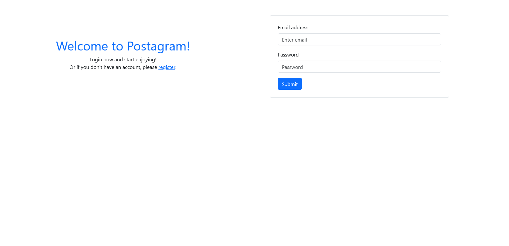
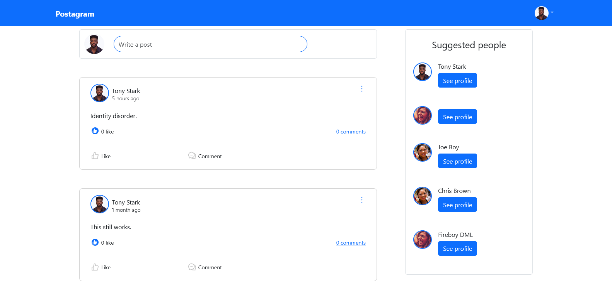

# POSTAGRAM - A Social Media Application 🎨

## Table of Contents 📚

-   [Overview](#overview)
-   [Screenshots](#screenshots)
-   [Features](#features)
-   [Key Highlights](#key-highlights)
-   [Tech Stack](#tech-stack)
-   [Resources](#resources)
-   [Author](#author)

## Overview 🖥️

This repository contains the **frontend source code** for **POSTAGRAM**, a social media application built with the
**React** JavaScript library. It powers the UI, handles user interactions, and communicates with the backend API
seamlessly.

## Screenshots 🖼️

### Login Page

### Home Page

## Features ✨

Users with the right permissions can:

-   👤 Create an account and maintain a personal profile
-   📝 Create, edit, and delete their own posts
-   👍 Like and 👎 dislike posts
-   👀 View posts by themselves and others
-   💬 Comment on posts (including their own)
-   ✏️ Edit and 🗑️ delete their own comments
-   👍 Like and 👎 dislike comments
-   🔍 View all comments on a specific post

### Key Highlights 🔑

-   User registration with login/logout support
-   JWT-based authentication system
-   Database storage integration
-   File storage (local for development, AWS S3 for production)
-   Caching with Redis ⚡
-   Unit and integration tests
-   GitHub Actions for CI/CD automation 🤖

## Tech Stack 🛠️

-   **React** (Frontend framework)
-   **JavaScript** (Programming language)

## Resources 📖

-   [MDN Web Docs](https://developer.mozilla.org/)

## Author 👨‍💻

**Tonye Hugo Onuoha** Email: [tonyeonuoha@gmail.com](mailto:tonyeonuoha@gmail.com)
